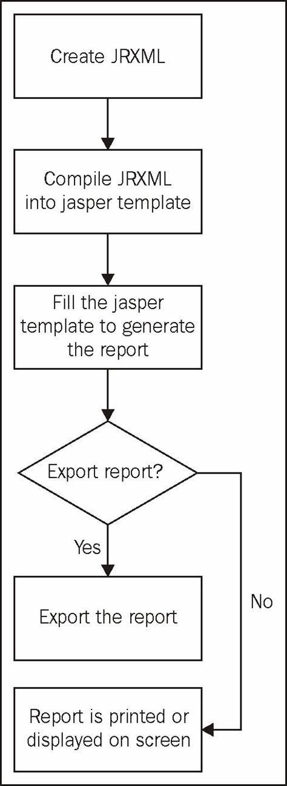

# jasper reports is a tool helping us to create file with template



# step 1: Create jrxml file


choose a template


## step 2: config fonts if you want to display vietnamese


## Step 3: load jrxml file and compile it


## Step 4: fill data param and export to jasperPrint


## Step 5: export to file


curl

	GET curl --location --request GET 'http://localhost:8080/test'

the output folder: `/out-put/`

	example: `/out-put/test.pdf`


## About `JRBeanCollectionDataSource` fill in

The SQL query is used to retrieve data from the database when using a JRResultSetDataSource. When using a JRBeanCollectionDataSource, the data is already in memory, so there is no need to retrieve it from the database.

In the example I provided earlier, the queryString element in the employee.jrxml file specifies the SQL query to retrieve data from the employees table:

<queryString>
    <![CDATA[SELECT * FROM employees]]>
</queryString>
However, this query is not used when using a JRBeanCollectionDataSource. Instead, the JRBeanCollectionDataSource is passed to the fillReport method, which provides the data for the report.


```java

    public byte[] generateReport(List<Employee> employees) throws JRException {
        Map<String, Object> parameters = new HashMap<>();
        parameters.put("createdBy", "Bing");
        parameters.put("createdDate", new Date());

        JRBeanCollectionDataSource dataSource = new JRBeanCollectionDataSource(employees);
```

```xml
<?xml version="1.0" encoding="UTF-8"?>
<!DOCTYPE jasperReport PUBLIC "-//JasperReports//DTD Report Design//EN" "http://jasperreports.sourceforge.net/dtds/jasperreport.dtd">
<jasperReport name="employee" pageWidth="595" pageHeight="842" columnWidth="555" leftMargin="20" rightMargin="20" topMargin="20" bottomMargin="20">
    <field name="id" class="java.lang.Integer"/>
    <field name="name" class="java.lang.String"/>
    <field name="age" class="java.lang.Integer"/>
    <field name="salary" class="java.lang.Double"/>
    <title>
        <band height="50">
            <staticText>
                <reportElement x="0" y="0" width="555" height="30"/>
                <text><![CDATA[Employee Report]]></text>
            </staticText>
        </band>
    </title>
    <pageHeader>
        <band height="30">
            <staticText>
                <reportElement x="0" y="0" width="100" height="20"/>
                <text><![CDATA[ID]]></text>
            </staticText>
            <staticText>
                <reportElement x="100" y="0" width="100" height="20"/>
                <text><![CDATA[Name]]></text>
            </staticText>
            <staticText>
                <reportElement x="200" y="0" width="100" height="20"/>
                <text><![CDATA[Age]]></text>
            </staticText>
            <staticText>
                <reportElement x="300" y="0" width="100" height="20"/>
                <text><![CDATA[Salary]]></text>
            </staticText>
        </band>
    </pageHeader>
    <detail>
        <band height="30">
            <textField>
                <reportElement x="0" y="0" width="100" height="20"/>
                <textFieldExpression><![CDATA[$F{id}]]></textFieldExpression>
            </textField>
            <textField>
                <reportElement x="100" y="0" width="100" height="20"/>
                <textFieldExpression><![CDATA[$F{name}]]></textFieldExpression>
            </textField>
            <textField>
                <reportElement x="200" y="0" width="100" height="20"/>
                <textFieldExpression><![CDATA[$F{age}]]></textFieldExpression>
            </textField>
            <textField>
                <reportElement x="300" y="0" width="100" height="20"/>
                <textFieldExpression><![CDATA[$F{salary}]]></textFieldExpression>
            </textField>
        </band>
    </detail>
</jasperReport>

```

## with `JRResultSetDataSource` fill in

```java
// Create a connection to the database
Connection conn = DriverManager.getConnection("jdbc:mysql://localhost:3306/mydatabase", "root", "password");

// Create a statement to execute the SQL query
Statement stmt = conn.createStatement();
ResultSet rs = stmt.executeQuery("SELECT * FROM employees");

// Create a JRResultSetDataSource using the ResultSet
JRResultSetDataSource dataSource = new JRResultSetDataSource(rs);
// Compile the report
        JasperReport jasperReport = JasperCompileManager.compileReport("employee.jrxml");

// Fill the report with data
        JasperPrint jasperPrint = JasperFillManager.fillReport(jasperReport, new HashMap<>(), dataSource);
```

```xml
<?xml version="1.0" encoding="UTF-8"?>
<!DOCTYPE jasperReport PUBLIC "-//JasperReports//DTD Report Design//EN" "http://jasperreports.sourceforge.net/dtds/jasperreport.dtd">
<jasperReport name="employee" pageWidth="595" pageHeight="842" columnWidth="555" leftMargin="20" rightMargin="20" topMargin="20" bottomMargin="20">
    <queryString>
        <![CDATA[SELECT * FROM employees]]>
    </queryString>
    <field name="id" class="java.lang.Integer"/>
    <field name="name" class="java.lang.String"/>
    <field name="age" class="java.lang.Integer"/>
    <field name="salary" class="java.lang.Double"/>
    <title>
        <band height="50">
            <staticText>
                <reportElement x="0" y="0" width="555" height="30"/>
                <text><![CDATA[Employee Report]]></text>
            </staticText>
        </band>
    </title>
    <pageHeader>
        <band height="30">
            <staticText>
                <reportElement x="0" y="0" width="100" height="20"/>
                <text><![CDATA[ID]]></text>
            </staticText>
            <staticText>
                <reportElement x="100" y="0" width="100" height="20"/>
                <text><![CDATA[Name]]></text>
            </staticText>
            <staticText>
                <reportElement x="200" y="0" width="100" height="20"/>
                <text><![CDATA[Age]]></text>
            </staticText>
            <staticText>
                <reportElement x="300" y="0" width="100" height="20"/>
                <text><![CDATA[Salary]]></text>
            </staticText>
        </band>
    </pageHeader>
    <detail>
        <band height="30">
            <textField>
                <reportElement x="0" y="0" width="100" height="20"/>
                <textFieldExpression><![CDATA[$F{id}]]></textFieldExpression>
            </textField>
            <textField>
                <reportElement x="100" y="0" width="100" height="20"/>
                <textFieldExpression><![CDATA[$F{name}]]></textFieldExpression>
            </textField>
            <textField>
                <reportElement x="200" y="0" width="100" height="20"/>
                <textFieldExpression><![CDATA[$F{age}]]></textFieldExpression>
            </textField>
            <textField>
                <reportElement x="300" y="0" width="100" height="20"/>
                <textFieldExpression><![CDATA[$F{salary}]]></textFieldExpression>
            </textField>
        </band>
    </detail>
</jasperReport>
```


